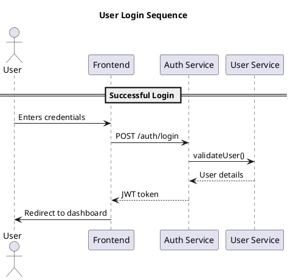

# Authentication Module Diagrams

This directory contains PlantUML diagrams for the Authentication module. The diagrams are organized by feature and type.

## Directory Structure

```
diagrams/
└── auth/
    ├── sequences/          # Sequence diagrams
    │   ├── login.puml      # Login flow
    │   ├── register.puml   # Registration flow
    │   ├── otp_flow.puml   # OTP verification flow
    │   └── password_reset.puml  # Password reset flow
    ├── states/             # State diagrams
    │   └── session_states.puml
    ├── components/         # Component diagrams
    │   └── auth_components.puml
    └── classes/            # Class diagrams
        └── auth_classes.puml
```

## Generating Diagrams

### Prerequisites

1. Install PlantUML:

   ```bash
   # For Windows (using Chocolatey)
   choco install plantuml

   # For macOS (using Homebrew)
   brew install plantuml

   # For Linux (Debian/Ubuntu)
   sudo apt-get install plantuml
   ```

2. Install GraphViz (for layout):

   ```bash
   # Windows
   choco install graphviz

   # macOS
   brew install graphviz

   # Linux
   sudo apt-get install graphviz
   ```

### Generate All Diagrams

```bash
# From the project root
find ./bsaas-docs/diagrams -name "*.puml" -exec plantuml -tsvg {} \;
```

### Generate Single Diagram

```bash
plantuml -tsvg ./bsaas-docs/diagrams/auth/sequences/login.puml
```

## Viewing Diagrams

### VS Code Extension

1. Install "PlantUML" extension by jebbs
2. Open any .puml file
3. Use `Alt+D` to preview the diagram

### Online Viewer

1. Copy the PlantUML code
2. Paste into [PlantUML Web Server](http://www.plantuml.com/plantuml/uml/)

## Diagram Standards

1. **Naming Conventions**
   - Use lowercase with underscores for file names
   - Be descriptive but concise
   - Example: `user_registration_flow.puml`

2. **Style Guidelines**
   - Use consistent colors and styles
   - Include proper titles and legends
   - Keep diagrams focused on a single flow

3. **Version Control**
   - Commit both .puml and generated .svg files
   - Update diagrams when related code changes

## Adding New Diagrams

1. Create a new .puml file in the appropriate directory
2. Follow existing patterns
3. Add a reference in this README
4. Generate and commit the .svg file

## Example Diagram


