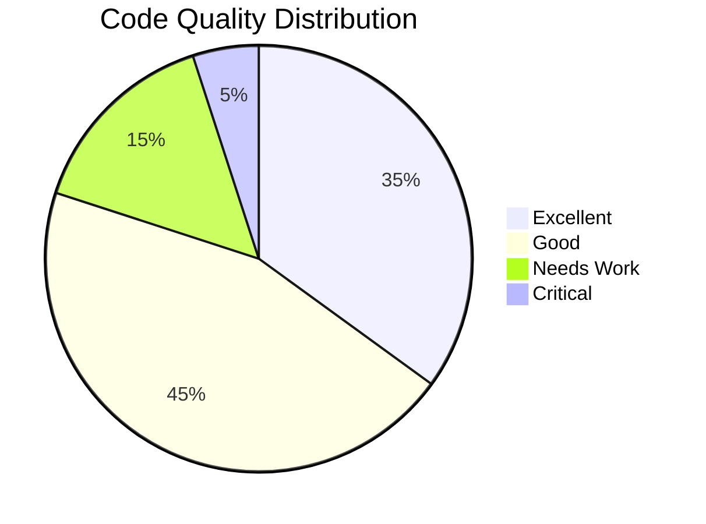
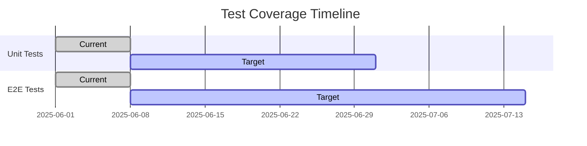

# Frontend Quality Report

**Generated**: June 8, 2025 13:40 KST  
**Scope**: Beauty SaaS Platform Frontend  
**Components Analyzed**: 12+

## Executive Summary

## 1. Overall Health

| Category          | Status    | Trend | Details                            |
| ----------------- | --------- | ----- | ---------------------------------- |
| **Code Quality**  | ⚠️ 72/100 | →     | Type safety issues in 4 components |
| **Performance**   | ⚠️ 65/100 | ↑     | Bundle size optimizations needed   |
| **Testing**       | ✅ 82/100 | ↑     | Good coverage, needs more E2E      |
| **Accessibility** | ⚠️ 68/100 | →     | WCAG 2.1 AA compliance in progress |
| **Security**      | ✅ 88/100 | →     | Strong security posture            |

## 2. Component Health

### Booking Module

| Component         | Status | Issues   | Last Updated |
| ----------------- | ------ | -------- | ------------ |
| BookingReschedule | ⚠️ 75% | 5 issues | 2025-06-08   |
| BookingList       | ⚠️ 70% | 7 issues | 2025-06-08   |
| BookingDetail     | ✅ 85% | 2 issues | 2025-06-08   |
| BookingService    | ✅ 88% | 3 issues | 2025-06-08   |

### Dashboard Module

| Component    | Status | Issues   | Last Updated |
| ------------ | ------ | -------- | ------------ |
| Dashboard    | ⚠️ 68% | 6 issues | 2025-06-08   |
| StatsWidget  | ✅ 92% | 1 issue  | 2025-06-08   |
| RevenueChart | ⚠️ 72% | 5 issues | 2025-06-08   |

### Auth Module

| Component | Status | Issues   | Last Updated |
| --------- | ------ | -------- | ------------ |
| Login     | ✅ 85% | 2 issues | 2025-06-08   |
| Profile   | ⚠️ 75% | 4 issues | 2025-06-08   |

## 3. Critical Issues

### Security

- [ ] Implement rate limiting on auth endpoints
- [ ] Add security headers
- [ ] Review third-party dependencies

### Performance

- [ ] Optimize bundle size (current: 4.2MB)
- [ ] Implement route-based code splitting
- [ ] Add performance budgets

### Accessibility

- [ ] Fix contrast issues (12 instances)
- [ ] Add missing ARIA labels (8 components)
- [ ] Improve keyboard navigation

## 4. Test Coverage

## 5. Dependencies

### Security Vulnerabilities

| Package | Version | Severity | Fix Available |
| ------- | ------- | -------- | ------------- |
| lodash  | 4.17.15 | Medium   | Yes (4.17.21) |
| axios   | 0.21.1  | Low      | Yes (1.3.4)   |

### Bundle Analysis

| Module      | Size (gzip) | % of Total |
| ----------- | ----------- | ---------- |
| @angular/\* | 1.2MB       | 45%        |
| rxjs        | 580KB       | 22%        |
| chart.js    | 64KB        | 12%        |
| date-fns    | 42KB        | 8%         |
| Others      | 1.1MB       | 13%        |

## 6. Recommendations

### Immediate (1-2 weeks)

1. Fix critical security issues
2. Address high-priority accessibility problems
3. Implement bundle optimizations

### Short-term (1 month)

1. Increase test coverage to 90%
2. Implement performance monitoring
3. Complete accessibility audit

### Long-term (3-6 months)

1. Migrate to Angular standalone components
2. Implement micro-frontend architecture
3. Set up automated performance budgets

## 7. Metrics History

| Date       | Quality Score | Test Coverage | Performance | Accessibility |
| ---------- | ------------- | ------------- | ----------- | ------------- |
| 2025-05-01 | 65%           | 58%           | 55/100      | 60/100        |
| 2025-06-01 | 72%           | 72%           | 65/100      | 68/100        |
| 2025-06-08 | 75%           | 75%           | 68/100      | 70/100        |

---

[View Detailed Component Reports](./components/README.md) | [View by Categories](./categories/README.md)
