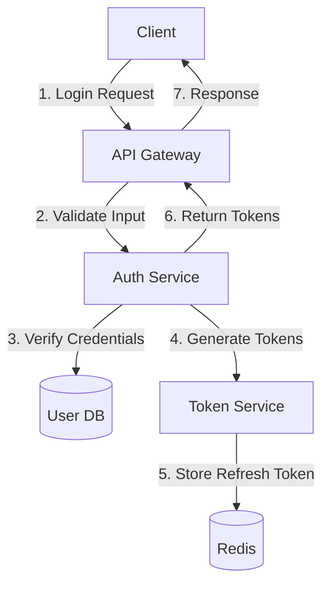

# Login - Design Details

## Architecture

### High-Level Design



### Components

1. **Auth Controller**
   - Handles HTTP requests
   - Validates input
   - Returns responses

2. **Auth Service**
   - Business logic for authentication
   - Credential verification
   - User session management

3. **Token Service**
   - JWT generation/validation
   - Token refresh logic
   - Token blacklisting

4. **User Repository**
   - User data access
   - Password verification
   - Account status checks

## Data Flow

### Email/Password Login

1. User submits login form with email and password
2. Frontend validates input format
3. Backend verifies credentials against database
4. If 2FA is enabled, generate and send verification code
5. On successful verification, generate access and refresh tokens
6. Return tokens to client and establish session
7. Redirect to dashboard or requested page

### Social Login

#### OAuth Flow

1. Client initiates OAuth flow with provider
2. User authenticates with provider
3. Provider redirects to our callback URL with auth code
4. Server exchanges code for access token
5. Server fetches user profile
6. Server creates or updates local user record
7. Server generates session tokens
8. Server returns tokens to client

#### Direct Token Flow

1. Client sends provider and access token
2. Server validates access token with provider
3. Server creates or updates user account

## Security Considerations

### Password Security

- BCrypt with work factor 12
- Minimum password length: 12 characters
- Password complexity requirements:
  - At least 1 uppercase letter
  - At least 1 lowercase letter
  - At least 1 number
  - At least 1 special character

### Token Storage

- **Access Token**: Stored in memory (not localStorage)
- **Refresh Token**: HTTP-only, Secure, SameSite=Strict cookie

### Session Security

- HttpOnly, Secure, SameSite cookies
- Short-lived access tokens
- Refresh token rotation
- Server-side session invalidation
- Device fingerprinting

### Data Protection

- Encryption at rest (AES-256)
- Encryption in transit (TLS 1.3+)
- Sensitive data masking in logs
- Secure password reset flow

### Rate Limiting

- 5 failed attempts within 15 minutes locks account
- 100 requests per minute per IP
- 10 password reset requests per hour per IP

## Performance Considerations

### Optimizations

- Redis caching for session data
- Connection pooling for database
- Asynchronous logging
- Cached user permissions
- CDN for static assets

### Scalability

- Stateless authentication
- Horizontal scaling support
- Database read replicas
- Rate limiting at edge

## Error Handling

### Error Types

1. **Validation Errors**
   - Invalid email format
   - Missing required fields
   - Invalid field types

2. **Authentication Errors**
   - Invalid credentials
   - Account locked
   - Email not verified

3. **Rate Limiting**
   - Too many requests
   - Too many failed attempts

### Error Response Format

```json
{
  "error": {
    "code": "invalid_credentials",
    "message": "Invalid email or password",
    "details": {
      "field": "password",
      "reason": "incorrect"
    }
  }
}
```

## Monitoring and Logging

### Metrics

- Login success/failure rates
- Login latency
- Token refresh rates
- Error rates by type

### Logs

- All authentication attempts
- Token generation/validation
- Security events
- System errors

## Future Considerations

### Multi-Factor Authentication

- TOTP support
- SMS/Email verification
- Security keys

### Passwordless Authentication

- Magic links
- Biometric authentication
- WebAuthn

### Account Recovery

- Backup codes
- Recovery questions
- Trusted devices
