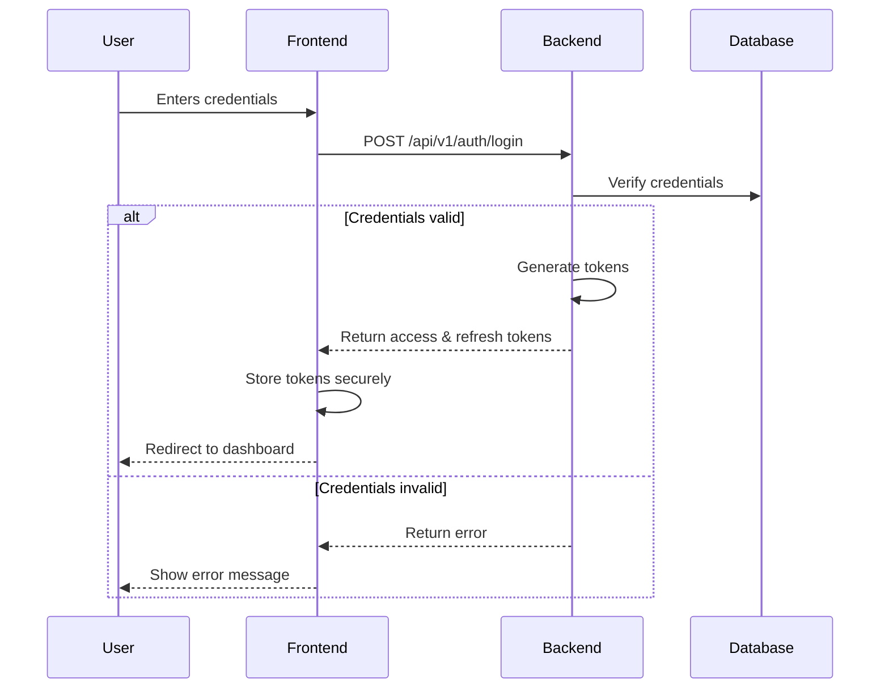

# Login Implementation

## Overview

The login functionality provides secure authentication for users to access the beauty SaaS platform. It supports both email/password and social login methods, with optional 2FA for enhanced security.

## Authentication Flow

## Security Considerations

For comprehensive security policies and implementation details, please refer to the main [SECURITY.md](../../SECURITY.md) document.

### Implementation-Specific Security Notes

- Tokens are stored in HTTP-only, secure cookies
- CSRF protection using same-site cookies
- IP-based rate limiting is enforced
- Password strength validation is implemented client and server-side

### Implementation Details

### Backend

- Uses JWT for stateless authentication
- Implements refresh token rotation
- Rate limiting per IP address
- Input validation using class-validator
- Logs all authentication attempts

### Frontend

- Secure token storage in memory
- Automatic token refresh before expiration
- Handles session timeout gracefully
- Implements proper error handling

## Error Handling

| Error Code | HTTP Status | Description           |
| ---------- | ----------- | --------------------- |
| AUTH-001   | 400         | Invalid email format  |
| AUTH-002   | 401         | Invalid credentials   |
| AUTH-003   | 429         | Too many attempts     |
| AUTH-004   | 403         | Account locked        |
| AUTH-005   | 500         | Internal server error |

## Session Management

### Active Sessions

- Users can view and manage active sessions
- Sessions show device, location, and last activity
- Option to log out from other devices

### Session Timeout

- Inactive sessions expire after 12 hours
- Modal warning appears 2 minutes before timeout
- Option to extend session

## Testing Requirements

### Unit Tests

- [ ] Verify email validation
- [ ] Test password hashing
- [ ] Test token generation
- [ ] Test session management

### Integration Tests

- [ ] Test login flow
- [ ] Test failed login attempts
- [ ] Test session timeout
- [ ] Test concurrent sessions

### Security Tests

- [ ] Test CSRF protection
- [ ] Test rate limiting
- [ ] Test token refresh
- [ ] Test brute force protection
